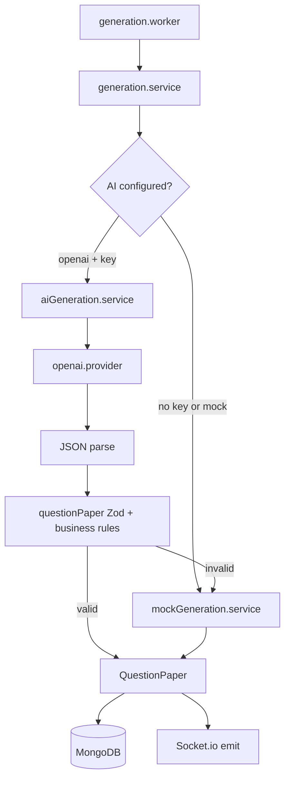

# Phase 4: AI Question Generation and PDF Quality

## Goals

- Replace worker-only mock generation with a real AI path (OpenAI) while preserving the exact [`QuestionPaper`](backend/src/types/assignment.types.ts) JSON contract Phase 3 relies on.
- Fall back safely to [`mockGeneration.service.ts`](backend/src/services/mockGeneration.service.ts) when `OPENAI_API_KEY` is missing or AI/validation fails.
- Clarify generation states on the output page and improve PDF/print output (header, totals, sections) without redesigning the app chrome.

## What stays unchanged

- REST routes, Socket.io events, Zustand store shape, [`lib/api.ts`](lib/api.ts), [`lib/socket.ts`](lib/socket.ts), page routes (`/assignments`, `/create`, `/assignment-output?id=`).
- Visual language (glass-card, Topbar, SectionBlock styling); changes are additive/refinements inside existing layouts.

## Backend architecture



### 1. Environment ([`backend/src/config/env.ts`](backend/src/config/env.ts))

Add optional vars (do not require key at startup):

| Variable | Default | Purpose |
|----------|---------|---------|
| `AI_PROVIDER` | `mock` | `openai` or `mock` |
| `OPENAI_API_KEY` | — | Required when provider is `openai` |
| `OPENAI_MODEL` | `gpt-4o-mini` | Chat model for generation |

Helper: `isAiGenerationEnabled()` → `AI_PROVIDER === 'openai' && OPENAI_API_KEY` is non-empty.

Update [`backend/.env.example`](backend/.env.example) and [`backend/README.md`](backend/README.md).

Install dependency: `openai` in [`backend/package.json`](backend/package.json).

### 2. New services under `backend/src/services/`

| File | Role |
|------|------|
| [`generation.service.ts`](backend/src/services/generation.service.ts) | **Facade** — `generateQuestionPaper(assignment)`; picks AI vs mock; always returns validated `QuestionPaper` |
| [`aiGeneration.service.ts`](backend/src/services/aiGeneration.service.ts) | Build prompt from assignment fields; call provider; parse JSON |
| [`openai.provider.ts`](backend/src/services/openai.provider.ts) | Thin OpenAI SDK wrapper: `generateJsonCompletion(system, user)` using `response_format: { type: 'json_object' }` |
| Keep [`mockGeneration.service.ts`](backend/src/services/mockGeneration.service.ts) | Unchanged fallback implementation |

**Prompt inputs** (from `IAssignment`):

- `title`, `instructions`, `questionTypes` (type, count, marksPerQuestion)
- Computed `totalQuestions`, `totalMarks`

**Prompt output contract**: JSON matching `QuestionPaper` minus server-owned fields (`assignmentId`, `generatedAt` can be filled server-side after validation).

**AI failure handling** (all log + fallback to mock, do not fail the job unless mock also throws):

- Missing key / provider `mock`
- OpenAI network/API error
- Invalid JSON
- Zod / business validation failure

### 3. Validation ([`backend/src/validators/questionPaper.schema.ts`](backend/src/validators/questionPaper.schema.ts))

Zod schemas mirroring [`QuestionPaper`](backend/src/types/assignment.types.ts):

- `generatedQuestionSchema`, `generatedSectionSchema`, `questionPaperSchema`
- Enums: question `type`, `difficulty` (`Easy` | `Moderate` | `Challenging`)
- MCQ: `options` array length 4 when type is `MCQ`
- String max lengths (e.g. question text ≤ 2000 chars) to keep responses safe

**Business validator** `validateQuestionPaperForAssignment(paper, assignment)`:

- `sections.length` === count of `questionTypes` with `count > 0`
- Each section: `questions.length === questionType.count`
- Each question: `marks === questionType.marksPerQuestion`
- `totalQuestions` / `totalMarks` match assignment totals
- Strip/fill server fields: `assignmentId`, `title`, `instructions`, `generatedAt` (ISO now), assign `randomUUID()` to missing question `id`s, renumber `number` 1..n per section

Export `parseAndValidateQuestionPaper(raw, assignment): QuestionPaper` used by AI path and optionally to sanity-check mock output.

### 4. Worker change ([`backend/src/workers/generation.worker.ts`](backend/src/workers/generation.worker.ts))

- Replace `generateMockQuestionPaper` with `generateQuestionPaper` from `generation.service`.
- Remove artificial `setTimeout(1500)` delay (real AI latency is sufficient; mock is fast).
- On thrown error after mock fallback also fails: existing `failed` status + socket event (unchanged).

### 5. Logging

- On startup: log active generation mode (`openai` vs `mock fallback`).
- On AI fallback: `console.warn` with reason (no API key, validation failed, etc.).

---

## Frontend improvements

### 6. Generation status UX ([`app/(dashboard)/assignment-output/page.tsx`](app/(dashboard)/assignment-output/page.tsx))

**Fix status logic** (bug: `generationStatus === undefined` currently treated as completed):

```ts
const isQueued = generationStatus === 'queued'
const isProcessing = generationStatus === 'processing'
const isGenerating = isQueued || isProcessing
const isCompleted = generationStatus === 'completed' && !!assignment.questionPaper
const isFailed = generationStatus === 'failed'
// Mock offline viewer: no generationStatus but has questionTypes
const isMockPaper = !generationStatus && !isFailed && !isGenerating
```

**New component** [`components/vedaai/GenerationStatusPanel.tsx`](components/vedaai/GenerationStatusPanel.tsx):

- Horizontal 4-step indicator: Queued → Processing → Completed / Failed
- Uses existing colors (orange accent, muted text, glass-card container)
- Distinct copy per state; show `generationError` on failed
- Replace inline spinner block in output page with this panel when `isGenerating || isFailed || isQueued`

Keep Regenerate button and socket listeners unchanged.

### 7. PDF and print quality

**A. Dynamic header** — extend [`StudentInfoSection.tsx`](components/vedaai/StudentInfoSection.tsx) props (backward-compatible defaults for hardcoded school text):

- `schoolName`, `subjectLine`, `duration`, `totalMarks`, `totalQuestions`, `assignmentTitle`
- Pass from [`QuestionPaper.tsx`](components/vedaai/QuestionPaper.tsx): use `questionPaper` totals when present, else `assignment`

**B. Summary block** in [`QuestionPaper.tsx`](components/vedaai/QuestionPaper.tsx) (above sections, same card style):

- Assignment title (prominent)
- Instructions
- “Total Questions: X | Total Marks: Y”

**C. Print/PDF CSS** — add [`styles/print.css`](styles/print.css) (import in [`app/layout.tsx`](app/layout.tsx) or dashboard layout):

- `@media print`: white background, hide non-print UI, `page-break-inside: avoid` on question blocks
- Class `print:hidden` on screen-only controls (already partially used)

**D. html2canvas options** in `handleDownloadPDF`:

- `backgroundColor: '#ffffff'`
- `scale: 2`, `logging: false`
- Target only `#printable-content` (already ref-based)
- Optional: multi-page slice improvement (keep current loop but ensure white margins)

No change to jsPDF dependency.

### 8. TypeScript / build

- **Backend**: `npm run build` in `backend/`
- **Frontend**: `npm run build` at repo root
- Fix any new errors; for pre-existing Framer Motion `ease: 'easeOut'` typing in touched files, use `as const` on ease strings in [`SectionBlock.tsx`](components/vedaai/SectionBlock.tsx) / [`QuestionPaper.tsx`](components/vedaai/QuestionPaper.tsx) if they block `tsc`

---

## Files to create / modify

| Area | Files |
|------|-------|
| Backend config | `config/env.ts`, `.env.example`, `README.md` |
| Backend services | `generation.service.ts`, `aiGeneration.service.ts`, `openai.provider.ts` |
| Backend validation | `validators/questionPaper.schema.ts` |
| Backend worker | `workers/generation.worker.ts` |
| Backend deps | `package.json` (+ `openai`) |
| Frontend UI | `GenerationStatusPanel.tsx`, `assignment-output/page.tsx` |
| Frontend PDF | `StudentInfoSection.tsx`, `QuestionPaper.tsx`, `styles/print.css` |

**Not modified**: API routes, controllers, Mongoose model, frontend store/API/socket contracts.

---

## Testing checklist

1. **No API key**: create assignment → mock paper generated; server logs mock fallback.
2. **With `OPENAI_API_KEY` + `AI_PROVIDER=openai`**: paper content is topic-relevant to title/instructions; structure validates.
3. **Regenerate**: new paper, socket events fire, UI steps update.
4. **Invalid AI response** (simulate): falls back to mock, job still completes.
5. **Output page**: distinct queued / processing / completed / failed states.
6. **PDF download**: white background, header with title/totals, readable sections.
7. `npm run build` passes in both `backend/` and project root.
